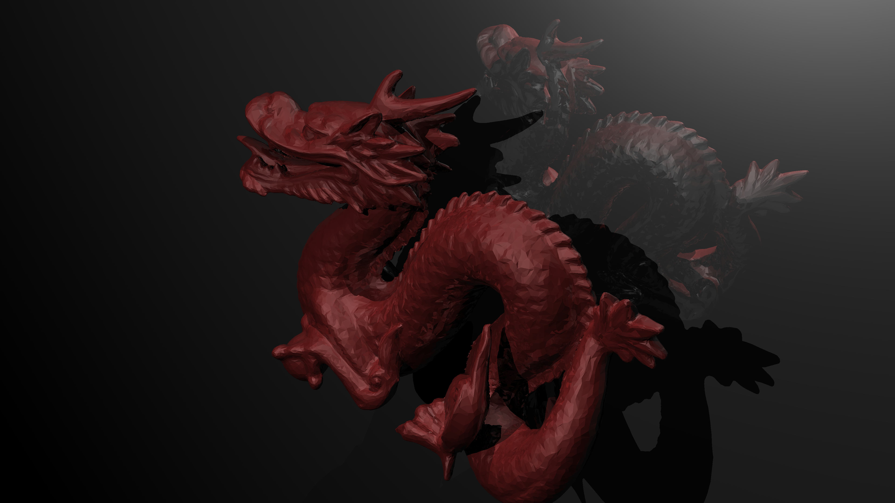
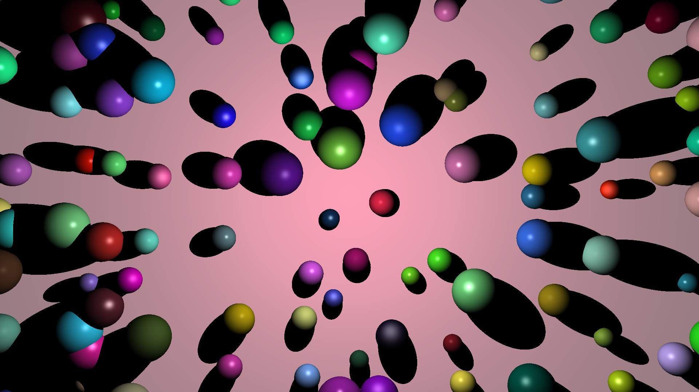

# IMT-RayTracer 🚀

Ce projet implémente un moteur de rendu 3D par lancer de rayons (Ray Tracing) performant, capable de générer des images réalistes avec ombres portées et reflets spéculaires. Il inclut également un outil de comparaison d'images pour valider les rendus.





## 🛠️ Compilation

Le projet utilise Maven. Vous pouvez compiler l'intégralité du projet en une seule commande, mais deux artefacts distincts peuvent être générés via les profils d'artefacts IntelliJ ou la configuration Maven.

### Générer le JAR global

À la racine du projet :

```bash
mvn clean package
```

Le fichier JAR sera généré dans le dossier `target/`.

-----

## 💻 Exécution des fichiers JAR

Deux JAR pré-compilés sont disponibles dans le dossier `out/artifacts/` pour une utilisation immédiate.

### 1\. Génération de rendu (RayTracer)

Le moteur de rendu attend un fichier de description de scène en argument. Il utilise le multithreading (non implémenté dans le rendu final) pour exploiter tous les cœurs du CPU.

**Commande :**

```bash
java -jar out/artifacts/RayTracer/RayTracer.jar <chemin_vers_scene.test>
```

*L'image générée sera sauvegardée selon le nom défini dans le fichier `.test` (par défaut `output.png`).*

### 2\. Comparaison d'images (ImgCompare)

Cet outil permet de comparer un rendu généré avec une image de référence pour valider l'exactitude mathématique du moteur.

**Commande :**

```bash
java -jar out/artifacts/ImgCompare/ImgCompare.jar <image1.png> <image2.png>
```

**Résultat :**

- Affiche `OK` si la différence est inférieure à 1000 pixels.
- Affiche `KO` sinon et génère un fichier `diff.png` mettant en évidence les écarts.

-----

## ✨ Fonctionnalités implémentées

### Géométrie et Scène

- **Formes** : Support des sphères, plans infinis et triangles (Algorithme de Möller-Trumbore).
- **Accélération** : Structure de données **BVH (Bounding Volume Hierarchy - Pour la version 4K Uniquement, non implémenté dans le rendu final)** pour un rendu rapide des scènes complexes (ex: Dragon Stanford à 50k triangles).
- **Récursion** : Gestion de la réflexion miroir via le paramètre `maxdepth`.

### Illumination et Matériaux

- **Modèle de Blinn-Phong** : Gestion des reflets spéculaires et de la brillance (`shininess`).
- **Diffusion de Lambert** : Calcul réaliste de la lumière sur les surfaces mates.
- **Ombres portées** : Lancer de rayons d'ombre (*Shadow Rays*) vers les sources de lumière ponctuelles et directionnelles.

-----

## 🧪 Tests Unitaires

Pour valider les briques de base (calculs vectoriels), lancez :

```bash
mvn test
```

Les tests couvrent les opérations critiques sur les vecteurs, points et couleurs.

-----

*Développé dans le cadre du module Conception Orientée Objets - IMT Nord Europe.*